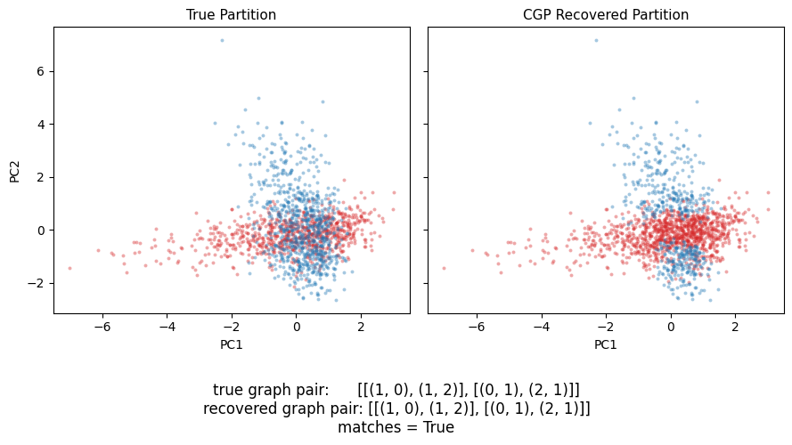

# Causal Graph Probing for DAG Mixture Recovery and Clustering

<p align="center">
  
</p>

This repo contains code for SURF 2024 research project, conducted by Jeff Duan (Cital Global Fixed Income SURF Fellow) and advised by Dr. Frederick Eberhardt.

Project summary: Causal discovery algorithms typically focus on recovering a single causal graph
from a dataset. But in reality, a dataset often consists of subsets generated by
distinct DAGs, and approximating this mixture with one graph
can be misleading.
Existing data-partitioning
methods
assume the causal structure is constant across the dataset (and at most, only the
edge parameters vary). We operate in the paradigm where the DAGs themselves are 
held to vary.

Main comparisons and visualization: notebooks/demo.ipynb

## Method

To complete the task, we implemented:

- **Averaged Residuals (AR)** — a loss function scoring how well a single DAG fits
  a dataset. We fit a linear SEM by least squares and average the per-node sum
  of squared residuals. 

  AR lends itself to a non-linear variant (n-AR) that allows us to generalize to 
  nonlinear data using polynomial features (see below)
- **Causal Graph Probing (CGP)** — the search framework: cluster the
  dataset (k-means), estimate each cluster's "affinity" toward each of two
  candidate DAGs by measuring how adding it to random subsets moves their
  AR, then partition clusters by affinity and take the DAG pair with the
  lowest combined AR ("Final AR") across the whole 2-graph space. Testing along
  clusters allows for efficient computation

Both were validated on synthetic 3-node linear-Gaussian SEM mixtures. 

## Extending to non-linear, >3-node, and >2-DAG cases

- **Nonlinear-AR** ([`cgp/nonlinear.py`](cgp/nonlinear.py)) augments each node
  with polynomial features (`x, x^2, ...`), allowing us to perform CGP
  on nonlinear data. We show that our method is robust on such data compared to 
  the standard EM algorithm

- **Greedy discovery for >3 nodes (prototype)** ([`cgp/discovery.py`](cgp/discovery.py)):
  Instead of enumerating all graph pairs, we use 
  a BIC-scored greedy algorithm (add/remove/reverse edge moves) to first
  generate a
  pool of candidate DAGs.

- **>2-graph mixtures (prototype)**: Compute per-candidate swing on each of k>2 graphs

  Note that we have not run extensive
  tests on the last two methods.

## Repo layout

```
cgp/          CGP + AR implementation, covariance-based formulation, alternative EM implementation
scripts/      CLI entry points (run experiments, generate data, benchmark, exploratory analysis)
notebooks/    demo.ipynb -- how CGP works, CGP vs. EM
tests/        pytest suite
external/     setup instructions + patches for the two upstream tools this depends on
data/         synthetic datasets used in experiments
results/      raw AR-across-graph-space output, benchmark suite's CSV output
docs/         docs/notes/ for design/investigation notes
```

## Setup

```sh
pip install -r requirements.txt
```

## Testing and benchmarking

```sh
pip install pytest  # not in requirements.txt; only needed to run the test suite
pytest tests/

python scripts/benchmark_ar.py          # covariance backend vs. reference implementation
python scripts/run_benchmark_suite.py   # heuristic CGP vs. mixture EM, many graph pairs, linear + quadratic
```

## Rapid CGP Using the Scatter Matrix

Averaged Residuals can be equivalently formulated in terms of the dataset's scatter matrix &
a couple of sufficient statistics. This allows us to perform several "DAG vs. point subset"
computations (used by the affinity step of CGP) at once using a single scatter-matrix computation,
rather than repeatedly fitting OLS. 

The covariance matrix representation is inspired by similar methods in PCA. 
We write the full implementation here for clarity + explain how it speeds up CGP.

### Setup

Denote our data as a matrix $X \in \mathbb{R}^{n\times d}$ ($n$ = # observations, $d$ = # variables).
Denote column $j$ as $X_j \in \mathbb{R}^{n}$.
We center each column (subtract the mean) beforehand such that every $X_j$ has mean $0$, simplifying
computation downstream.

As a result of centering, the scatter matrix simplifies to $S = X^\top X \in \mathbb{R}^{d\times d}$ and is 
equivalent to the unnormalized covariance matrix.
Recall that the entires of $S$ are given by $S_{ab} = \sum_{i=1}^{n} X_{ia}X_{ib} = X_a^\top X_b$.

**Computing $S$ without storing $X$.** Since CGP involves repeated fitting of least squares along different
point sets (e.g. calculating affinity when moving a cluster around), 
it would be inefficient to store the data matrix $X$ for each computation on such a point set.

Instead we log a couple of sufficient statistics (much more compressed) and use them to quickly derive the
relevant scatter matrix at each iteration. The statistics that we store are
$n$, the column-sum vector $s = \sum_i x_i$, and
$Q = X_{\text{raw}}^\top X_{\text{raw}}$ (the product of the uncentered, raw data matrices).
The centered scatter of the full dataset can then be recovered as:

$$S = Q - \frac{ss^\top}{n},$$

(this follows immediately from the identity
$\sum_i (x_i-\bar x)(x_i-\bar x)^\top = \sum_i x_ix_i^\top - n\bar x\bar x^\top$
with $\bar x = s/n$). 

Notably, $(n, s, Q)$ are **additive** across
disjoint point sets, so the scatter of a union of point sets is the sum of their
statistics.

### AR score

A DAG model $G$ represents each child node $v$ as a function of its parents plus noise ($f(v_{\mathrm{pa}}) + \epsilon$). 
AR calculates the least-squares fit of each column $X_j$ in terms of its parent columns:

$$\mathrm{AR}(G) = \frac{1}{d}\sum_{j=1}^{d} \widehat{\mathrm{Var}}\big(X_j - \hat f_j(X_{\mathrm{pa}(j)})\big)
= \frac{1}{d}\sum_{j=1}^{d} \mathrm{SSR}_j/(n-1).$$

(in the first equality, representing in terms of variance follows from least-squares being an unbiased estimator.
In the second equality, note that a parentless node actually contributes its plain variance
$S_{jj}/n$).

We proceed by showing that we may represent $\mathrm{SSR}_j$ as a function of $S$, allowing us to
compute AR score using our sufficient stats machinery.

### AR score in scatter form

Given a node $j$ with parent set $P$, denote by $X_P \in \mathbb{R}^{n\times p}$ the matrix of its parents. 
When we regress $X_j$ on $X_P$ with no intercept (columns are centered), we get edge weights $\beta$.
The normal equations of least squares give us an analytical solution:
$X_P^\top X_P \hat\beta = X_P^\top X_j \Rightarrow S_{PP}\hat\beta = S_{Pj}$.

Here $S_{PP}$, $S_{Pj}$ are the associated block matrices of $S$. We thus have:

$$\hat\beta = S_{PP}^{-1} S_{Pj}.$$

This gives us a formula for the fitted weights in terms of only $S$. We plug this into the equation for SSR.
Again by the normal equations (and plugging in our simplification
$\hat\beta^\top S_{PP}\hat\beta = \hat\beta^\top S_{Pj}$), we have:

$$\mathrm{SSR}_j = (X_j - X_P \hat\beta)^\top(X_j - X_P \hat\beta) = 
S_{jj} - 2 \hat\beta^\top S_{Pj} + \hat\beta^\top S_{PP}\hat\beta = S_{jj} - \hat\beta^\top S_{Pj},$$

Now substituting $\hat\beta = S_{PP}^{-1}S_{Pj}$:

$$\mathrm{SSR}_j = S_{jj} - S_{jP}S_{PP}^{-1}S_{Pj}.$$

This is our final, closed-form equation that we use. The calculation is simply:
```
sol = np.linalg.solve(S_PP, S_Pj)
ssr = S_jj - S_Pj @ sol
```

To tie things up, remember that this is fast because:
1. By computing $S$ once, we may use the above formula to score many DAGs against the same 
   point set (just choose different parent indices $P$)
2. Calculating affinity in CGP basically scores "a background subset ∪ a cluster" several times.
  By the additivity of $(n, s, Q)$, we can do this by adding the stat tuples for both subsets and then
  conducting the solve above. 

The nonlinear extension ([`cgp/nonlinear.py`](cgp/nonlinear.py)) does the exact same
computation, but on an augmented matrix (each parent column $X_p$ is substituted by the
block of higher order terms
polynomial block $[X_p, X_p^2, \dots, X_p^{\deg}]$, and ordinary least-squares proceeds as normal).

### Closing Interpretation

The above was a lot of algebra, but it lends an intuitive way to interpret AR.
You might notice that $ SSR_j $ is equivalent to the Schur complement of $ S_{PP} $ in

$$\begin{bmatrix} S_{PP} & S_{Pj} \\ S_{jP} & S_{jj} \end{bmatrix}$$

Dividing by $n$ and using $S = n\widehat{\mathrm{Cov}}$ gives

$$\frac{\mathrm{SSR}_j}{n} = \widehat{\mathrm{Cov}}_{jj} - \widehat{\mathrm{Cov}}_{jP}\widehat{\mathrm{Cov}}_{PP}^{-1}\widehat{\mathrm{Cov}}_{Pj} = \widehat{\mathrm{Var}}\big(X_j \mid X_{\mathrm{pa}(j)}\big),$$

Thus each AR term is approximately the
node $j$'s variance conditional on its parents.
